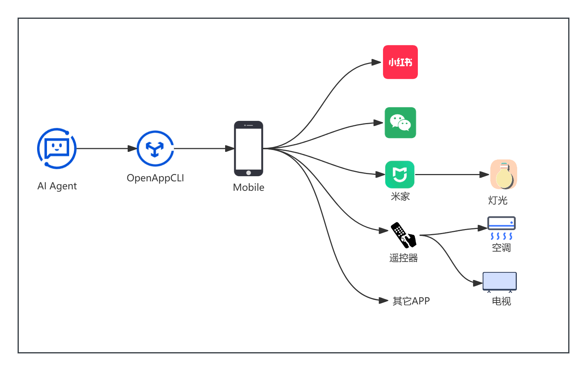

# OpenAppCLI
## 简介
- 核心功能：通过计算机的命令行界面（CLI）操控移动端应用程序。
- 项目愿景：旨在赋能 AI 代理（Agent），使其具备自主操作手机应用程序的能力。

----
## 🧾 实现清单
### 📱手机系统 CLI
- launch-app: 启动指定的应用程序
- sps: 保存当前应用页面的 UI 层级结构/源码。
- push-file:向移动设备推送文件（支持图片、文本等）。

### 📕 Xiaohongshu (XHS) CLI
- xhs-publish: 发布内容（支持类型：album相册选取 / text图文或长文笔记）。
- xhs-search: 搜索用户及笔记内容。
- xhs-details: 根据笔记 ID 获取详情（提取文案、下载视频及图片）。
- xhs-index: 获取首页信息流（包含“发现”、“关注”及 LBS 地理位置列表）。

### 💬 微信 (WX) CLI
微信需要通过截图和OCR来进行定位操作，建议在有GPU的计算机中进行
- wx-init: 初始化程序，主要用于生成定位锚点，后继操作都是通过这些锚点来计算位置
- 持续开发中....⏳
----
## 💻环境准备
1. 准备手机
   - 出于安装考虑不建议使用自己日常的手机给Agent进行操作
   - 本技能只支持Android系统的手机
   - 建议使用真机进行自动化操作,理论上可以使用模拟器和云手机
   - 如果使用真机连接电脑,建议使用原厂的USB线,或者质量较好的数据线(选最粗的一条线).
   
2. 手机设置
   - 开启“开发者选项”,连续点击“版本号”7次可开启,不同手机可能开启方式不一样,请自行搜索开启
   - 启动“USB调试”:进入“开发者选项”，打开 “USB调试”
   - 关闭"监控ADB安装应用"
   - 关闭"通过USB验证应用"

3. 应用及Java Android安装
   - 安装并登录小红书APP
   - 安装Java JDK 8或 JDK 11/17
   - Android SDK:提供 adb(Android Debug Bridge) 工具，用于电脑与模拟器/真机通信，还提供元素定位工具 uiautomatorviewer.以下安装包根据情况二选一即可(一般用户推荐轻量级安装)
     - 轻量级：直接下载 Android SDK Command-line Tools。
       - [command-line-tools-only下载](https://developer.android.google.cn/studio?hl=zh-cn#command-line-tools-only)
     - 完整版：下载并安装 Android Studio，然后在设置中下载对应的 SDK 包
       - [Android Studio下载](https://developer.android.google.cn/studio?hl=zh-cn)
       
4. Node.js
   - Appium 2.x 是基于 Node.js 开发的，需要它通过 npm 来安装和管理
   - Node.js 版本建议 ^14.17.0 || ^16.13.0 || >=18.0.0

5. 安装 Appium 2.x 及相关驱动
   - 安装 Appium 服务器:npm install -g appium
   - Appium 2.x 安装驱动:appium driver install uiautomator2
   - Appium 的 Python 客户端库:pip install Appium-Python-Client

6. 命令行启动Appium服务
   - appium --allow-insecure=uiautomator2:adb_shell 
   
7. Redistributable下载并安装
   - 使用EasyOCR进行文字识别，需要用到Redistributable
   - [Microsoft Visual C++ Redistributable](https://aka.ms/vs/17/release/vc_redist.x64.exe)
----
## 🛠️技术支持
> 环境配置有一定的技术门槛,如果需要提供帮助或者更多功能,可直接联系开发者  
> 📧 邮箱:zfengyy@qq.com   